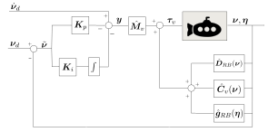
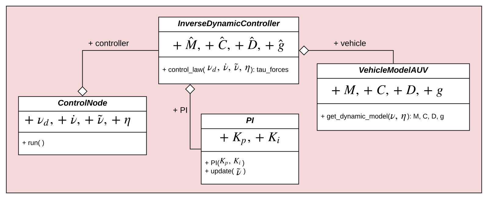
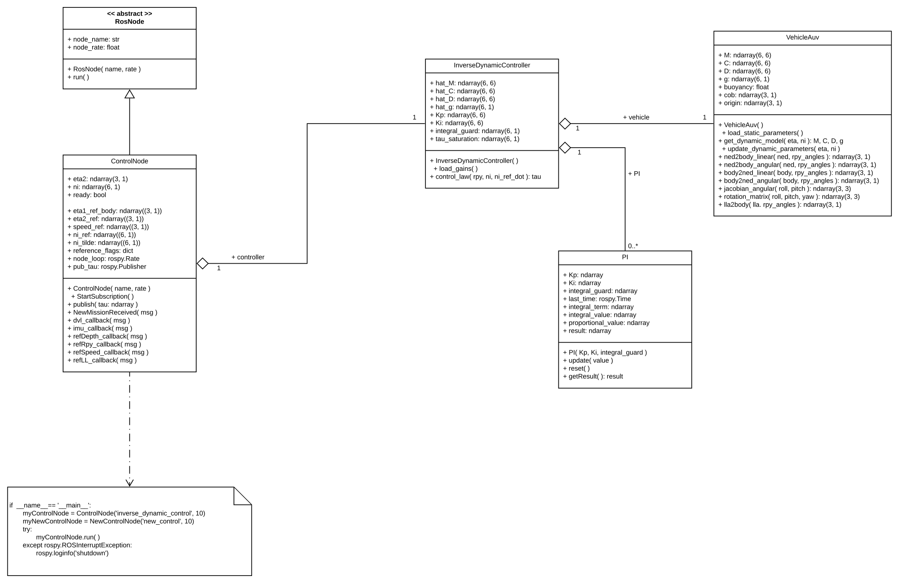
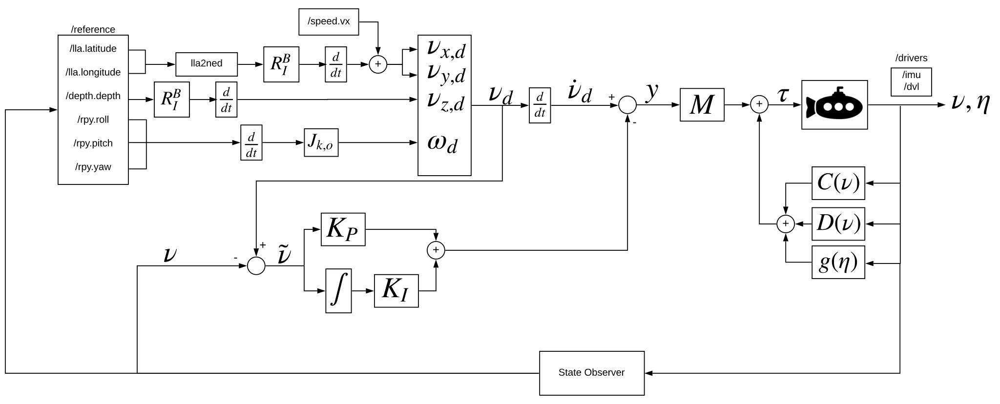
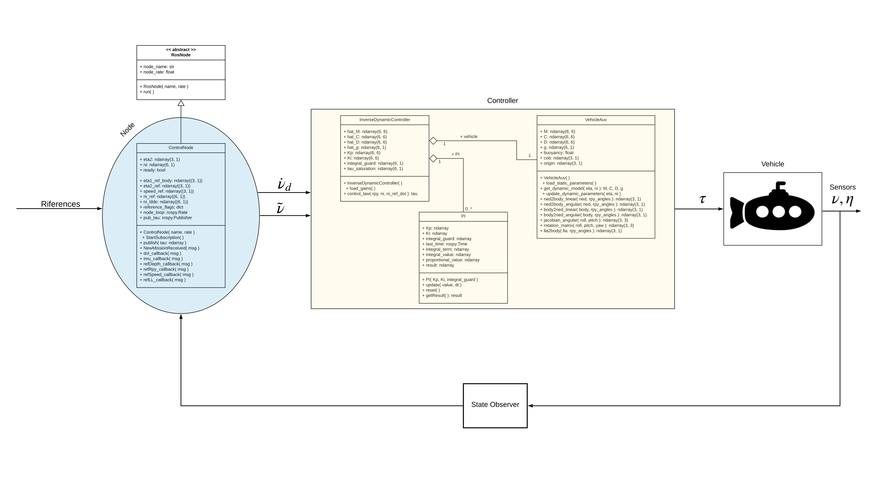

# Feedback Linearization Controller for AUV.
(AUV = Autonomous Underwater Vehicle)

## Introduction and Installation
This repository implement a Feedback Linearization Controller for AUV in Python with ROS middleware. 
This Controller has been implemented in a faithful simulation of AUV designed in MDM Lab of University of Florence.
With a modular property of ROS, old PID controller has been replaced by this new inverse-dynamic based controller. 
Reference for this project is: <a href="https://www.fossen.biz/wiley/"> Fossen documentation </a>

Requirements are: <a href="http://wiki.ros.org/ROS/Tutorials"> ROS </a> and <a href="https://www.python.org/download/releases/2.7/"> python language </a>.

## Feedback Linearization
This control guarantees asymptotic stability with dynamic of error expressed in body-fixed frame.

## UML
Generic function of Controller:

- ControlNode: RosNode that interface directly with ROS platform to preleve reference.
- InverseDynamicController: Class that implement mathematical operations for Controller.
- PI: Class that implement Proportional-Integral component of velocity error dynamic.
- VehicleModelAUV: Class that implement the dynamic model for the AUV considered.

### Class Diagram 

## Reference Scheme
Using Fossen documentation, "Decoupling in the BODY Frame (Velocity Control)", have to be careful to how the references are expressed, if <body> or <ned>. This project needs reference in body-fixed frame [1].

## Global Implementation
The follow provides a complete vision of project and how to integrate it.

